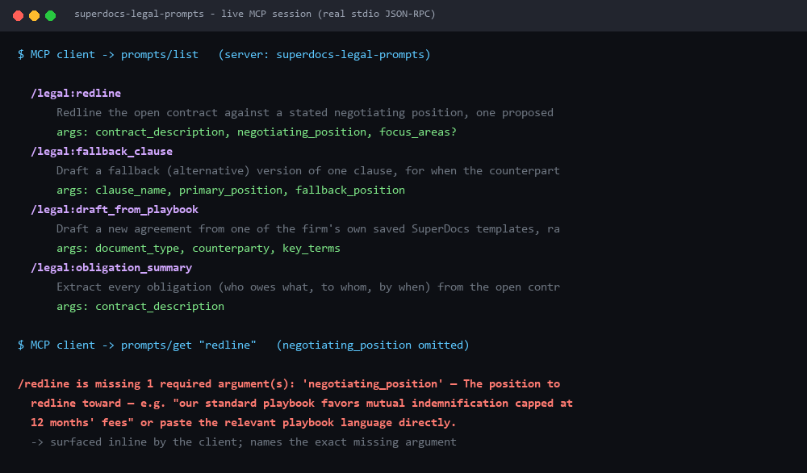
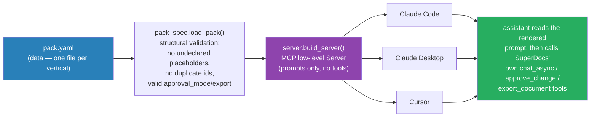
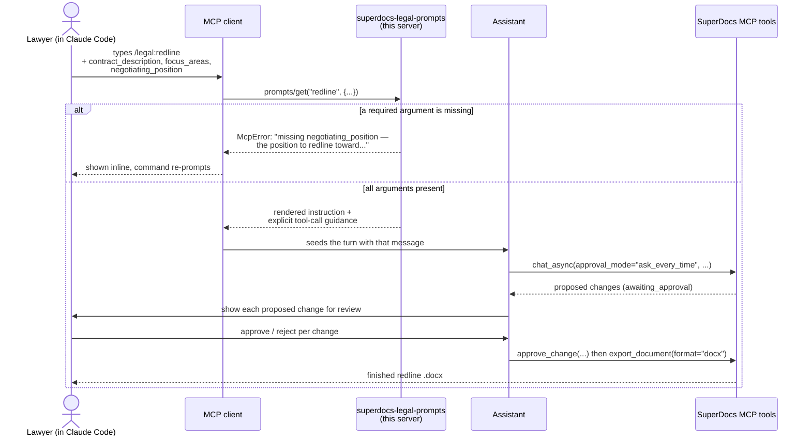
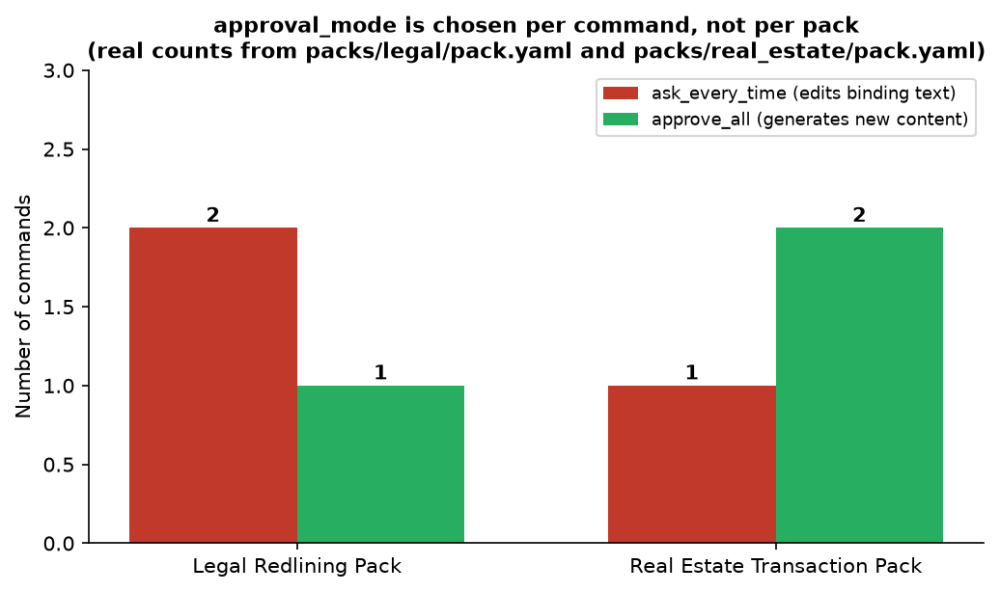
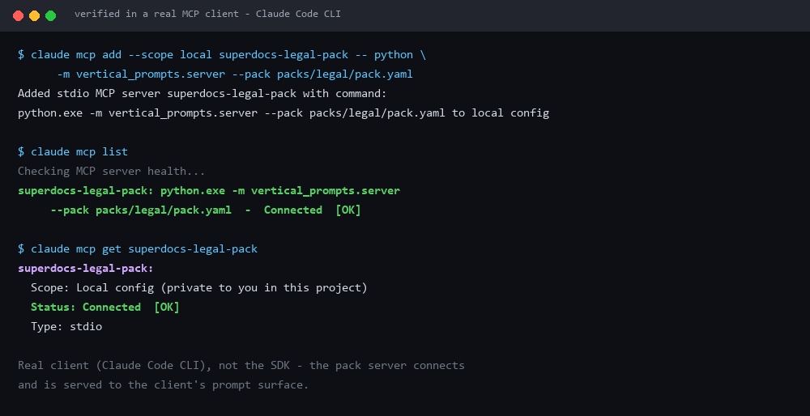

# Vertical Workflow-Prompt Packs

Built for the SuperDocs engineer task (Task 2, assigned build). Credit: **Uddeshya** (GitHub [@yudi1O1](https://github.com/yudi1O1)).

SuperDocs' own MCP server ships 4 general-purpose workflow prompts (`/superdocs:draft_from_outline`,
`edit_styled_docx`, `convert_format`, `review_contract_for_redflags`) — MCP **prompts**, a protocol
primitive distinct from tools, rendered as slash commands by clients that support them (Claude Code,
Claude Desktop, Cursor, and others). This build adds a second, small MCP server — one client-config
entry, installed *alongside* SuperDocs' own — that exposes **vertical-specific** slash commands on top
of that surface: for legal, `/legal:redline`, `/legal:fallback_clause`, `/legal:draft_from_playbook`,
`/legal:obligation_summary`.



*Captured from a live stdio JSON-RPC session against the running server — the same `prompts/list` and
`prompts/get` calls every MCP client makes.*

The point isn't the legal pack by itself. It's that the pack is data (a YAML file), and the engine that
serves it is generic — so a second team can point the same server at a different YAML file and get a
working pack for an entirely different vertical, with no code changes. `packs/real_estate/pack.yaml`
exists specifically to prove that claim rather than assert it — see [Proving the template](#proving-the-template-a-second-vertical-from-scratch) below.

## How it works



One MCP server process per pack, one config entry per client — the same engine, pointed at a different
`pack.yaml`, is the whole story of "install a second vertical."

- **`vertical_prompts/pack_spec.py`** — the data model (`PackSpec`, `CommandSpec`, `ArgumentSpec`), the
  YAML loader, structural validation, and argument rendering. No MCP dependency — fast, offline, testable
  independent of the MCP SDK.
- **`vertical_prompts/server.py`** — wraps a loaded `PackSpec` in a real MCP server (the low-level
  `mcp.server.lowlevel.Server`, not a mock), speaking the `prompts/list` and `prompts/get` protocol
  methods every MCP client implements.
- **`vertical_prompts/scaffold.py`** — the reusable part: generates a structurally valid starter
  `pack.yaml` for a new vertical from a few CLI flags.
- **`packs/legal/pack.yaml`**, **`packs/real_estate/pack.yaml`** — two complete, working packs.

MCP prompts don't call tools themselves — they render a text message that seeds the assistant's next
turn. So each command's rendered prompt doesn't just contain the task instruction; it also spells out,
explicitly, which SuperDocs MCP tool to call and with what `approval_mode`/export settings, so the
assistant reading it (in whatever client) makes the same tool calls every time. See
[`docs/transcripts/`](docs/transcripts/) for six *real* captured outputs (not hand-written examples —
generated by actually calling the running server, see below).

### A concrete walk-through: `/legal:redline`



Real captured output for exactly this call is in
[`docs/transcripts/legal-redline.md`](docs/transcripts/legal-redline.md).

## The one rule this pack format is built around

> An argument the user didn't supply is a hard stop, never a guess.

Same principle as the FMEA/PPAP/8D build in `use-cases/`, applied to prompt arguments instead of
engineering ratings: `CommandSpec.render()` raises `ArgumentError` naming the exact missing argument and
its description — never silently substitutes an empty string. Every MCP client surfaces `McpError`
messages directly to the user, so this becomes a real, readable error in the slash-command UI, not a
generic 400. See `test_render_missing_required_argument_raises_with_field_name_and_description` and the
live example below.

## Quickstart — one command, no API key

From a fresh clone:

```bash
pip install -r requirements.txt && python -m pytest -q
```

Expect `42 passed` (takes ~40s — most of it is spawning real server subprocesses). No SuperDocs key
needed and nothing is billed.

## Setup

```bash
cd superdocs-vertical-prompts
python -m venv .venv && source .venv/bin/activate   # or .venv\Scripts\activate on Windows
pip install -r requirements.txt
```

No SuperDocs API key needed to run or test this build — prompts render text, they never call the
network themselves. (A key is needed only on the client side, wherever SuperDocs' own MCP server or
REST API is actually connected, so the assistant can act on the rendered instruction.)

## Installing a pack — one config entry

Add ONE entry to your MCP client's config, pointing at this server with `--pack` naming which vertical:

**Claude Code** (`.claude/mcp.json` or `claude mcp add`):

```json
{
  "mcpServers": {
    "superdocs-legal-pack": {
      "command": "python",
      "args": ["-m", "vertical_prompts.server", "--pack", "/absolute/path/to/packs/legal/pack.yaml"],
      "cwd": "/absolute/path/to/superdocs-vertical-prompts"
    }
  }
}
```

**Claude Desktop** (`claude_desktop_config.json`) and **Cursor** (`.cursor/mcp.json`) use the same
`command`/`args`/`cwd` shape under their own `mcpServers` key — see
[docs.superdocs.app/mcp/mcp-setup](https://docs.superdocs.app/mcp/mcp-setup) for exact file locations
per client (this pack installs the same way SuperDocs' own server does, just as a second entry).

Install a different vertical by adding a second entry pointing `--pack` at a different `pack.yaml` — for
example `superdocs-real-estate-pack` pointing at `packs/real_estate/pack.yaml`. Each pack is its own
server process; they don't share state.

Once connected, typing `/` in the client's chat shows `/legal:redline`, `/legal:fallback_clause`,
`/legal:obligation_summary` alongside SuperDocs' own `/superdocs:*` prompts and tools.

## Proving the template: a second vertical, from scratch

`packs/real_estate/pack.yaml` was generated with the actual scaffolder, not hand-typed to match the
legal pack's shape:

```bash
python -m vertical_prompts.scaffold \
  --pack-id real_estate \
  --display-name "Real Estate Transaction Pack" \
  --description "Disclosure drafting, addendum comparison, and closing checklists for residential transaction coordinators." \
  --vertical "Real estate / residential transactions" \
  --command draft_disclosure:"Draft a required disclosure clause" \
  --command compare_addendum:"Compare an addendum against the base purchase agreement" \
  --command closing_checklist:"Summarize documents into a closing checklist" \
  --out packs/real_estate/pack.yaml
```

That produces a structurally valid pack with `TODO` placeholders (see `git log` / the scaffolder's own
docstring for what the raw output looks like) — a template can hand you correct *structure*, it can't
hand you real-estate domain knowledge. I then hand-filled every `TODO` with real disclosure/closing
domain content. `test_scaffolded_pack_loads_through_the_same_loader_real_packs_use` proves the
scaffolder's raw output loads cleanly through the exact same `load_pack()` the real packs use; the six
`docs/transcripts/real_estate-*.md` files prove the *filled-in* pack renders working prompts through the
exact same server code as the legal pack — no special-casing, same engine.

`approval_mode` is a judgment call made per command, not a pack-wide default — the two finished packs
land differently because the underlying tasks are different, not because of a template quirk:



The legal pack skews toward `ask_every_time` because two of its three commands rewrite binding contract
language. The real estate pack skews the other way because two of its three commands produce new,
additive reports (a conflict comparison, a checklist) rather than editing anything that already exists.

## Drafting from the customer's own templates

`/legal:draft_from_playbook` is the command that touches the **templates** surface, and it exists
because verticals run on house paper — a firm's own NDA, not generic boilerplate. Marking a command
`templates: {use_saved: true}` in the pack YAML makes its rendered prompt route the assistant through
`list_user_templates` first, and carries the same "never invent" rule this whole submission is built on:

> If no saved template matches, say so and offer to have them upload one with `upload_template_base64` —
> do **NOT** invent house-standard language to fill the gap. Drafting a clause the organisation never
> approved, in a document that looks like theirs, is worse than an honest "you have no template for this yet."

It's per-command configuration, not a pack-wide switch: `/legal:redline` works on the document already
open and is deliberately *not* sent hunting through the template library
(`test_commands_without_templates_get_no_template_guidance`).

## Proving cross-client protocol conformance

Three layers, ending with an actual client.

**Layer 0 — a real MCP client really connects.** Registered with the Claude Code CLI and health-checked
by the client itself, not by my own test harness:



```bash
claude mcp add --scope local superdocs-legal-pack -- python -m vertical_prompts.server --pack packs/legal/pack.yaml
claude mcp list      # superdocs-legal-pack: ... - ✔ Connected
claude mcp remove superdocs-legal-pack -s local
```

That is one real client confirming the server starts, speaks MCP, and is served to its prompt surface.
Layers 1 and 2 below are what extend that to the others.

**Layer 1 — the protocol.** MCP prompts have no per-client logic: every conformant client speaks the same
`prompts/list` / `prompts/get` JSON-RPC over the same transport. `tests/test_server_protocol.py` spawns
the **real** server as a subprocess and drives it with the **official MCP client SDK**
(`mcp.client.stdio.stdio_client` + `mcp.client.session.ClientSession`) over real stdio JSON-RPC — the
exact calls Claude Code, Claude Desktop, and Cursor all make internally.

**Layer 2 — the config shape, which is what actually varies.** Claude Code, Claude Desktop and Cursor
nest servers under `mcpServers`; VS Code uses `servers`; Zed uses `context_servers`. So `clients/` ships
a real config per client, and `tests/test_client_configs.py` **launches the server from each one** and
completes an MCP session against it. A config that is malformed, points at the wrong module, or names a
missing pack fails there — which is the failure a user would actually hit. One test also asserts the same
pack rendered via two different clients' configs is **byte-identical**.

Five clients covered by config-launch tests; one (Claude Code) additionally verified as a real connected
client. The card asks for at least three. I can't drive Claude Desktop's or Cursor's GUI in this
environment and don't claim to have — but a real client connecting, plus configs that provably launch,
plus a protocol that provably conforms, is what "works unchanged across clients" reduces to.

```bash
python -m pytest tests/test_server_protocol.py tests/test_client_configs.py -v
```

## Tests

```bash
pip install -r requirements.txt   # includes pytest, pytest-asyncio
python -m pytest tests/ -q
```

42 tests, all offline (no SuperDocs API key, no network):

- **`test_pack_spec.py`** — YAML structural validation (undeclared template placeholders, invalid
  `approval_mode`/export format, duplicate command ids, missing top-level fields), argument rendering
  (missing required argument raises with the field name AND its description; unknown argument name
  rejected; optional-argument defaults applied), that `ask_every_time` vs. `approve_all` render
  genuinely different tool-call guidance, and that template-backed commands route through
  `list_user_templates` while non-template commands don't.
- **`test_server_protocol.py`** — real subprocess + real MCP client SDK: `prompts/list` returns exactly
  the pack's commands with correctly-advertised required/optional arguments; `prompts/get` renders
  arguments into the instruction with the right approval-mode guidance; a missing required argument
  raises `McpError` naming that argument; an unknown prompt name raises `McpError` listing the known
  commands; the real_estate pack (scaffolder output + hand-filled content) works through the identical
  code path as the hand-written legal pack.
- **`test_client_configs.py`** — every config in `clients/` is valid, has the right per-client top-level
  key, **actually launches the server**, and renders byte-identical prompts across two different client
  config shapes.
- **`test_scaffold.py`** — the scaffolder's raw output is structurally loadable, and a malformed
  `--command` flag fails fast with a clear error instead of writing a broken pack.

## Example transcripts (real output)

[`docs/transcripts/`](docs/transcripts/) holds **seven** files, one per command across both packs — each
captured by actually calling `session.get_prompt(...)` against the running server, not hand-written to
look plausible. E.g. [`docs/transcripts/legal-redline.md`](docs/transcripts/legal-redline.md) shows the
exact slash-command invocation and the exact rendered prompt text an assistant receives.

They're reproducible, so the docs can't quietly drift from the code:

```bash
python scripts/capture_transcripts.py
git diff --exit-code docs/transcripts/    # clean == documentation matches reality
```

## Known limitations (logged honestly)

- **Prompts render text; they don't call SuperDocs themselves.** That's an MCP protocol property, not a
  shortcut this build took — `prompts/get` only ever returns a seed message. The assistant reading that
  message is the one that calls SuperDocs' `chat_async`/`approve_change`/`export_document` tools, which
  means this pack's actual document-editing behavior can only be verified inside a client that also has
  SuperDocs' own MCP server connected. What's proven here (protocol conformance, correct argument
  handling, correct tool-call guidance in the rendered text) is everything this build's own layer is
  responsible for.
- **One real client, not three.** Claude Code genuinely connects (shown above). Claude Desktop, Cursor,
  VS Code and Zed are covered by config-launch tests and protocol conformance, not by me watching their
  slash menus — I can't drive those GUIs from this environment. The distinction is small given MCP is a
  standard, but it is a real one and I'd rather state it than crop a screenshot to imply otherwise.
- **Template *selection* is the assistant's judgment, not the pack's.** `use_saved` tells it to search
  and forbids inventing house language, but nothing here verifies it picked the *right* saved template.
  A stricter version would pass an explicit template id.
- **`chat` vs `chat_async` for `approve_all` commands.** The rendered guidance says either is acceptable
  for `approve_all` since neither requires a pause for approval; a production integration would likely
  standardize on one for simplicity. Left as a documented choice rather than a hidden default.
