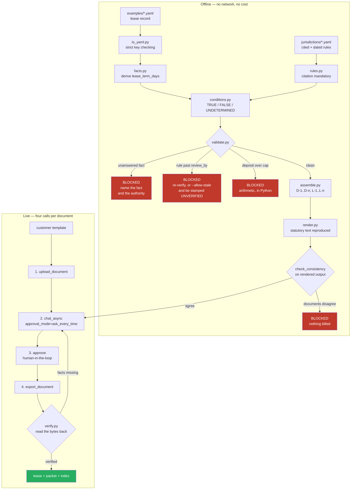

# Real Estate Pack by Jurisdiction

Built for the SuperDocs open task list (*"Real estate pack by jurisdiction"*, band S2 —
templates, Multi-document). Credit: **Uddeshya** (GitHub [@yudi1O1](https://github.com/yudi1O1)).

A residential lease and disclosure pack that knows where the property is. Give it a lease
record and a jurisdiction, and it works out which disclosures that property actually
requires, refuses to proceed if it cannot tell, and assembles three cross-referenced
documents onto a customer's own template through the SuperDocs API:

1. **the lease**, carrying the jurisdiction's required terms and an attachment schedule,
2. **the disclosure packet**, carrying every required notice with its statutory wording, and
3. **the compliance index**, an audit record of every rule evaluated — including the ones
   that did *not* apply — each with its authority, the date it was verified, and the date
   it falls due for re-verification.

> **This is a document assembly tool, not legal advice.** See
> [What this is not](#what-this-is-not).

## The card's bar, and how this build meets it

The task card asks for *"leases and disclosures where the required disclosures differ
meaningfully by market"*, and says a strong build is one where *"the jurisdiction-specific
disclosures are **correct and dated**"*.

Two words in that sentence do the work, and each is enforced structurally rather than
promised in prose:

| The bar | How it is made true |
| --- | --- |
| **differ meaningfully** | Four jurisdictions chosen because they diverge, not because they were easy. Nine disclosures are required in **exactly one** of the four. Asserted in [`test_each_jurisdiction_requires_something_none_of_the_others_do`](tests/test_jurisdiction_data.py). |
| **correct** | Every rule carries a real statutory citation and an official source URL. A rule missing either **cannot be loaded** — the parser raises. There is no way to add an uncited disclosure to this pack. |
| **dated** | Every rule carries `verified_on` and `review_by`. Once `review_by` passes the rule is **stale** and the pack refuses to draft. Fast-moving law gets a deliberately short cadence, so the gate actually fires. |

## The one rule this pack is built around

> An applicability question that cannot be answered is **undetermined**, never "no".

This is the whole safety property, and it is why the condition engine is three-valued
rather than boolean ([`conditions.py`](real_estate_pack/conditions.py)).

Consider a pre-1978 building whose construction year is missing from the record. A
two-state engine evaluates `year_built < 1978`, gets no value, answers *false*, and the
federally mandated lead-paint disclosure quietly drops out of the pack. The lease that
comes out the other side looks completely normal. Nothing is red. Nobody finds out until
it matters.

So a missing fact propagates as `UNDETERMINED`, and the validator turns that into a
blocking finding that names the exact fact and the exact authority:

```bash
python -m real_estate_pack check examples/incomplete_ca_unanswered.yaml
```

```
  BLOCKING [rule ca_death_on_premises] Cannot tell whether "Death on the Premises
  (Three-Year Lookback)" applies: death_on_premises_last_3_years was not supplied.
  An unanswered question is never read as 'does not apply' — supply it under
  disclosure_facts. Authority: Cal. Civ. Code § 1710.2 (verified 2025-08-01,
  review by 2027-03-31).

REFUSING TO DRAFT: 5 blocking finding(s). No API call was made and no operation was spent.
```

Note the third blocking finding in the committed output
([`docs/samples/blocked-unanswered-facts.txt`](docs/samples/blocked-unanswered-facts.txt)):
California's flood rule is an **OR** over two facts. One is answered "no", the other is
missing. That is genuinely undecidable — the disclosure could still be required by the
unanswered half — so the tool says so rather than guessing. The combinator also
short-circuits on a definite `false`, which is what stops a Texas property being asked for
a California bed-bug history.

Being strict is free: the gate is entirely offline, so a refusal costs nothing.

### The same rule, one level up

There is a second, subtler version of the same failure, and finding it changed the design.

Texas's flooding notice and New York's sprinkler notice are **mandatory in every
residential lease** and must be answered in *both* directions — a "no" is a disclosure,
not an exemption. The first version of this pack expressed that by keying applicability on
"has this been answered". That inverted the safety property exactly: leaving the question
blank made the rule not apply, and the mandatory notice silently vanished.

The fix is a separate `requires_facts` field. The rule always applies; the unanswered fact
blocks instead:

```
  BLOCKING [rule tx_flooding_disclosure] "Flooding Disclosure" is required here and must be
  answered in both directions, but in_100_year_floodplain, flooded_in_last_5_years were not
  supplied. A 'no' is a disclosure, not an exemption — supply them under disclosure_facts.
```

A test asserts the notice **stays in the required set** while incomplete
(`test_the_unanswered_mandatory_notice_still_appears_in_the_required_set`). It is required;
it is merely unfinished. It must not drop out.

## "Dated" is a gate, not a footnote

Every citation carries two dates. `review_by` is a real expiry, and the cadence is a
judgement about how fast that particular law moves:

```yaml
citation:
  authority: Cal. Civ. Code § 1950.5(c), as amended by AB 12 (2023), operative July 1, 2024
  source_url: https://leginfo.legislature.ca.gov/faces/codes_displaySection.xhtml?lawCode=CIV&sectionNum=1950.5
  verified_on: 2025-08-01
  review_by:   2026-06-30      # short, deliberately
  note: >-
    This cap changed recently and materially — the pre-July-2024 rule allowed two
    months unfurnished and three months furnished. A stale copy of this rule would
    approve a deposit that is now unlawful.
```

Five of the 29 shipped rules carry a short cadence: California's deposit cap and Tenant
Protection Act notice, New York's Good Cause Eviction status notice and its pre-1960 lead
pointer, and Florida's high-rise fire notice. Those are the rules where relying on last
year's version produces a document that is confidently, invisibly wrong.

**The consequence is that the California and New York examples block out of the box.**
That is the gate working. A test asserts every short-cadence rule carries a note
explaining *why* the window is short, because an unexplained short window is
indistinguishable from a typo.

`--allow-stale` proceeds — and the override is recorded **in the document**, not just in
the operator's memory:

```
| Ref | Requirement                                    | Status                       | Verified   | Review by  |
| L-2 | Tenant Protection Act — Rent Cap and Just Cause | UNVERIFIED — past review date | 2025-08-01 | 2026-06-30 |
| cap | Security Deposit Cap — One Month's Rent         | UNVERIFIED — past review date | 2025-08-01 | 2026-06-30 |
```

The full index for both the Texas and California examples — every rule evaluated, with its
authority and both dates — is committed as a readable table in
[`docs/samples/README.md`](docs/samples/README.md).

That `cap` row is there because of a bug this build had and fixed. A deposit cap is a
*check*, not a document, so it gets no `D-`/`L-` entry — and the index keyed its
UNVERIFIED marking off entries. A stale cap was therefore invisible in the audit record,
which is the single most dangerous omission the index could make: an out-of-date cap may
approve a deposit that is no longer lawful. Staleness is now read from the decision, not
from the entry.

## The four jurisdictions, and why these four

```bash
python -m real_estate_pack compare examples/compare_all_jurisdictions.yaml
```

One property, four rulesets, no API key, about a second
([committed output](docs/samples/compare-four-jurisdictions.txt)):

```
Jurisdiction Disclosures  Clauses  Blocking   Deposit verdict
------------------------------------------------------------------------------
US-CA                  3        2         1   OVER CAP — blocked
US-TX                  3        6         0   within limits
US-NY                  3        4         1   OVER CAP — blocked
US-FL                  4        3         0   within limits

Required in exactly one of these jurisdictions:
  - Bed Bug Information Notice                          (US-CA only)
  - Megan's Law Database Notice                         (US-CA only)
  - Flooding Disclosure                                 (US-TX only)
  - Vehicle Towing and Parking Rules Notice             (US-TX only)
  - Sprinkler System Notice                             (US-NY only)
  - Lead Paint — Additional Inquiry for Pre-1960 Buildings (US-NY only)
  - Radon Gas Disclosure                                (US-FL only)
  - Security Deposit — Notice of Depository and Claim Procedure (US-FL only)
  - Fire Sprinkler Notice — Multi-Storey Buildings      (US-FL only)
```

The four were picked to diverge along genuinely different axes:

- **California** — the heaviest disclosure burden and the fastest-moving law. Megan's Law,
  bed bugs, death on the premises, mold, flood hazard, demolition permits, shared meters.
  Deposit capped at one month.
- **Texas** — the deliberate opposite. Few disclosures, **no** deposit cap, municipal rent
  control preempted by statute. Its one distinctive requirement, the flooding notice, has
  no analogue in the others.
- **New York** — strongest tenant protections. Deposit capped at one month with **no**
  small-landlord exception, notice periods that scale with tenancy length, and a sprinkler
  notice required in every lease that exists almost nowhere else.
- **Florida** — agrees with Texas that there is no deposit cap, and diverges sharply by
  prescribing a verbatim notice about how the deposit is *held*. Plus radon, which is
  required in every Florida rental over 45 days and in no other state here.

That last pairing is why the pack models rules individually rather than sorting
jurisdictions into "strict" and "relaxed": two jurisdictions can agree on one axis and
diverge completely on another.

**The absence of a rule is itself a finding.** Texas and Florida each carry an explicit,
cited "there is no cap here" note rather than silence, because silence is
indistinguishable from an unfinished file. A test enforces it: every state must either cap
the deposit or say explicitly that it does not.

### Deposit caps are arithmetic, not prose

The clearest proof that jurisdiction is not cosmetic. The same $4,000 deposit on $2,000
rent, from one record:

```
  BLOCKING [tenancy.security_deposit] security_deposit of 4,000.00 exceeds the New York
  ceiling of 2,000.00 (1 x monthly_rent of 2,000.00). New York caps any deposit or advance
  at one month's rent for residential tenancies statewide. Authority: N.Y. Gen. Oblig. Law
  § 7-108(1-a)(a) ... The statutory cap admits no small-landlord exception, unlike
  California.
```

Computed in Python from the two numbers on the record — the model never touches it.
California's narrow small-landlord exception exists behind an explicit
`--small-landlord-exception` flag and is **never auto-applied**, because it turns on facts
about the landlord's whole portfolio that this pack cannot see. Asserting it raises the
ceiling and adds a warning saying the pack did not verify it. In New York the same flag
correctly has no effect.

## Three documents that have to agree

The card names `Multi-document`, and the interesting part of multi-document work is not
producing three files — it is producing three that agree. A lease whose attachment
schedule lists a disclosure the packet does not contain is worse than a lease with no
schedule, because it reads as complete.

Every rule that fires gets an id assigned **once** — `D-1`, `D-2`, … for disclosures,
`L-1`, `L-2`, … for lease clauses — and all three documents are rendered from that one
numbered list. `check_consistency` then verifies the claim on the **rendered output**
rather than on the data it came from, because checking the inputs would only prove the
inputs agreed with themselves:

- the packet contains exactly the disclosures that fired, and no stray references;
- the lease's attachment schedule names exactly those disclosures;
- the index accounts for every item in the pack;
- the pack reference, property address, term dates and landlord name appear identically in
  all three;
- statutorily prescribed text survived rendering **verbatim**.

Most of the tests for it deliberately *break* a rendered document and assert the checker
notices — a checker that has only ever seen correct input has not been tested. The check
runs before any billable call, and an inconsistent pack raises rather than drafting.

## Statutory text is reproduced, never generated

Where a statute prescribes exact words — Florida's radon paragraph, California's Megan's
Law notice, the federal Lead Warning Statement — that text lives in the jurisdiction YAML
and is emitted inside a marked block. The instruction sent to SuperDocs is explicit:

```
1. Any block marked class="statutory-verbatim" reproduces text prescribed word-for-word
   by statute. Reproduce it EXACTLY. Do not reword, summarise, modernise, correct, or
   re-punctuate it. Paraphrasing a prescribed notice makes it legally non-compliant.
2. Do not add any disclosure, clause, statute reference, or legal statement that is not in
   the content below. If something appears to be missing, say so in your response rather
   than supplying it.
```

Rule 2 matters as much as rule 1. The failure mode for a legal document is not a model
that refuses — it is a model that helpfully *adds* a plausible-sounding disclosure with no
citation and no date.

The `verbatim_statutory` flag is kept honest by a `preamble` field. Florida's deposit
notice prescribes two paragraphs word-for-word and surrounds them with ordinary fill-in
blanks; marking the whole notice verbatim would overclaim, and would tell the model not to
restyle a heading it is perfectly free to restyle. Only the prescribed half claims to be
statutory, and a test proves the blanks stay outside the protected block.

## Quickstart — one command, no API key

```bash
pip install -r requirements.txt && python -m pytest -q
```

Expect `402 passed`. No SuperDocs key needed, nothing billed, every test offline.

Then see the whole idea in one command, still free:

```bash
python -m real_estate_pack compare examples/compare_all_jurisdictions.yaml
```

## Usage

Five subcommands; four never touch the network.

```bash
# What does this jurisdiction need me to answer?
python -m real_estate_pack facts examples/incomplete_ca_unanswered.yaml

# Would this pack be compliant? (exit 0 = ok, 2 = refused)
python -m real_estate_pack check examples/tx_austin_apartment.yaml

# One property, several jurisdictions, side by side
python -m real_estate_pack compare examples/compare_all_jurisdictions.yaml

# Render the three documents to HTML, offline and free
python -m real_estate_pack preview examples/tx_austin_apartment.yaml --out-dir out

# Draft the pack onto a customer's template through SuperDocs (billable)
python -m real_estate_pack draft examples/tx_austin_apartment.yaml \
    --template templates/brokerage_template.html \
    --session-id austin-4412 --out-dir out
```

Exit codes are a CI contract, so a `check` can gate a pipeline:

| Code | Meaning |
| --- | --- |
| `0` | ok |
| `1` | bad input, bad configuration, or the API refused |
| `2` | refused — the pack has blocking findings |
| `3` | the assembled pack is internally inconsistent |
| `4` | drafted, but the result could not be verified |

`3` and `4` are separated from `1` deliberately: a run failing with `4` produced a document
that is on disk and wrong, which needs a different response from one that never started.

Useful flags: `--jurisdiction US-NY` runs a record against another state's rules;
`--today 2025-09-01` evaluates staleness as of a given date; `--allow-stale` proceeds past
expired rules and stamps them UNVERIFIED; `--only lease` drafts one document;
`--auto-approve` answers yes to every proposed change (CI and demos only — it still goes
through the real `/approve` endpoint).

Try the cross-jurisdiction check — a valid Texas lease fails three different ways in
New York:

```bash
python -m real_estate_pack check examples/tx_austin_apartment.yaml --jurisdiction US-NY
```

### Setup for live drafting

```bash
export SUPERDOCS_API_KEY=sk_your_key_here    # use.superdocs.app -> Settings -> API Keys
```

Pass the key by environment variable only. Don't paste it into a command line — it lands
in your shell history, which counts as a public place.

### Adding a jurisdiction

A YAML file, not a code change. Drop `us_wa.yaml` into `jurisdictions/`, give every rule a
citation with both dates, and it is picked up automatically — including by `compare` and by
the whole data-integrity test suite, which parametrises over whatever is present.

## How it uses SuperDocs

Per document, one session, four calls:

1. **Upload** — `POST /v1/documents/upload`: the customer's own template becomes the active
   document.
2. **Chat** — `POST /v1/chat/async` with `approval_mode: "ask_every_time"`: one instruction
   carrying the finished, pre-built content.
3. **Approve** — `POST /v1/chat/{session_id}/approve`: every proposed change is surfaced to
   a human before it lands.
4. **Export** — `POST /v1/documents/export`: the approved result as `.docx`/`.pdf`/`.md`.

Each of the three documents gets its own session (`austin-4412-lease`,
`austin-4412-disclosure_packet`, …) so a retry that re-uploads the pristine template cannot
inherit the previous document's edits. A `continue_prompt` pause is routed to `/continue`
rather than `/approve`, which is rejected with 409.

**The idempotency ledger is per document, not per run.** A pack is three documents;
answering one more disclosure question changes the compliance index and usually not the
lease. Re-billing the lease for that would be paying twice for the same output. The
fingerprint covers the session, the full instruction, the template's *bytes*, and the
export format.

## What the live runs showed

The offline suite is exhaustive: 401 tests covering rule loading, the tri-state engine, the
blocking gate, deposit arithmetic, assembly, consistency, rendering, verification, the CLI,
and the full orchestration and retry logic — the latter through a duck-typed fake client, so
the *real* workflow code executes and only the socket is fake. No mocking library, no key,
no cost.

Then it was run against the live API, and the live runs found things the offline suite
structurally could not.

### The retry earned its place: it fired on 4 of 6 documents

`scripts/demo_two_templates.py` drafts all three documents onto both customer templates —
six documents, so six billable operations if every one lands first time. It cost **ten**:

```
drafting onto brokerage (templates/brokerage_template.html) ...
  lease                2 attempt(s)
  disclosure_packet    1 attempt(s)
  compliance_index     1 attempt(s)
drafting onto law_firm (templates/law_firm_template.html) ...
  lease                2 attempt(s)
  disclosure_packet    2 attempt(s)
  compliance_index     2 attempt(s)

parity check
  lease                parity OK (14 facts present in both)
  disclosure_packet    parity OK (6 facts present in both)
  compliance_index     parity OK (11 facts present in both)

Cost: 10 billable request(s) issued.
```

Content parity held for all three documents — but **four of the six drafts did not land on
the first attempt.** Every one of those four returned a job SuperDocs reported as
`completed`. Without verification driving the retry, four wrong documents would have shipped
with a success message. This is the single strongest justification for the design, and it is
measured rather than argued.

My prediction in an earlier draft of this README was that the *disclosure packet* would be
the fragile one, being longest. Wrong — the **lease** needed a retry on both templates. Noted
because a guess that turns out wrong is worth as much as one that turns out right, and only
the live run could settle it.

### The finding that contradicted a claim I was about to make

The parity run passed, and passing hid a real defect. The two exports were compared byte for
byte out of suspicion at their identical file size, and:

```
marker                          in brokerage   in law_firm
MERIDIAN (masthead)             False          False
Licensed Residential Brokerage  False          False
HOLLOWAY & REYES LLP            False          False
Chancery Row (footer)           False          False

A == B (extracted text): True
```

**Neither customer template's branding survived, and the two documents were textually
identical.** "Drafted onto the customer's own template" was not true. The parity test passed
precisely *because* the template had no effect — a green test that proved the opposite of
what it appeared to.

A free diagnostic (upload is not billable) split it into two distinct faults:

| Fault | Where it happens | Status |
| --- | --- | --- |
| CSS in a `<style>` block is discarded | **Ingestion.** `class=` attributes survive, the stylesheet defining them does not. | **Not fixable by instruction** — see limitations. |
| Letterhead, masthead and footer deleted | **The edit turn.** The branding is intact in the uploaded document, then replaced wholesale — 37 changes for one lease. | **Fixed.** |

The fix was rule 5 of the instruction, telling the model to preserve existing elements and
replace only the bracketed placeholders. Re-run on the same template and record:

```
Review: 1 change(s) approved, 0 rejected.        # was 37
```

| Marker | Old instruction | With rule 5 |
| --- | --- | --- |
| `MERIDIAN` | absent | **present** |
| `Licensed Residential Brokerage` | absent | **present** |
| `Kestrel Way` (footer) | absent | **present** |
| `lettings@meridian-residential.example` | absent | **present** |
| every content fact (`TX-AUS-4412`, `D-1`, `L-5`, …) | present | **present** |

Branding preserved, content unchanged. Locked in by
`test_the_instruction_tells_the_model_to_preserve_the_customers_template`.

### What is still not proven

- **Visual styling from an HTML template does not survive at all.** Fonts, colours and rules
  live in a `<style>` block, and ingestion drops it. The two shipped templates were `.html`
  "so the diff is readable in a pull request" — a choice that undermined the one thing they
  existed to demonstrate. A real `.docx` template carrying Word styles is the right vehicle
  and is not yet tested here.
- **n=1.** One parity run is not a failure rate. The retry fired 4 times out of 6 in that
  sample; treat that as "this is flaky and now guarded", not as a measurement.
- **Only the Texas pack was drafted live.** California and New York block on stale rules by
  design, so their live behaviour with `--allow-stale` is untested.
- **The `usage` block reports `0/500` even after eleven billable requests.** This tool prints
  what the server sends rather than counting locally, so it faithfully reports a figure that
  appears not to be tracking. Flagged rather than papered over — see *Worth reporting
  upstream*.

Reproduce any of it:

```bash
python scripts/demo_two_templates.py --example examples/tx_austin_apartment.yaml
```

Ten operations on the observed retry rate, ledger disabled so it measures fresh draws. The
script says the same thing about its own limits in its output.

## Worth reporting upstream

Neither is a crash; both are integration hazards.

1. **A `<style>` block is dropped on ingestion while its `class` attributes are kept.** The
   stored document keeps `class="masthead"` with nothing defining `masthead`, so an HTML
   template round-trips as structure without appearance. Worth documenting, because "upload
   your template" reads as though styling comes with it.
2. **The `usage` block returned `monthly_used: 0` across eleven billable requests.** An
   integrator building spend controls on that field would build them on a constant.

## Tests

```bash
python -m pytest tests/ -q      # 402 passed, all offline
```

Ten modules:

- [`test_conditions.py`](tests/test_conditions.py) — the tri-state engine. Missing facts are
  undetermined, not false; `all` short-circuits on a definite false so unrelated
  jurisdictions' facts are never demanded; an OR with one "no" and one unknown stays
  undecided; a truthy non-boolean is not an answer to a yes/no question; an unknown
  operator raises rather than being skipped.
- [`test_rules.py`](tests/test_rules.py) — a rule without a citation cannot load; each of the
  four citation components is individually mandatory; a disclosure with no body is refused;
  duplicate and federally-colliding ids are refused; federal rules sort first.
- [`test_jurisdiction_data.py`](tests/test_jurisdiction_data.py) — integrity of the shipped
  legal content. Every rule cited, sourced and dated; no verification date after the
  research date; every short review window explained; **and the card's premise asserted** —
  the four jurisdictions differ pairwise, each requires something unique to it, the federal
  layer is shared by all, and the same deposit is lawful in exactly two of them.
- [`test_validate.py`](tests/test_validate.py) — the blocking gate: unanswered applicability,
  mandatory-notice completeness, staleness (and `--allow-stale`), deposit caps across four
  jurisdictions including a cent over and exactly at the cap, and record integrity.
- [`test_assemble.py`](tests/test_assemble.py) — numbering stability, and eight tests that
  deliberately corrupt a rendered document to prove the consistency checker catches it.
- [`test_render.py`](tests/test_render.py) — statutory fidelity, escaping of hostile party
  names, citations and dates reaching the page, and the instruction's prohibitions.
- [`test_verify.py`](tests/test_verify.py) — including the parametrised invariant that
  whatever the renderer emits must satisfy the verifier, for every jurisdiction and every
  document kind.
- [`test_workflow.py`](tests/test_workflow.py) — the four-call contract, approval rounds,
  `continue_prompt` routing, no-op detection, partial-application retry, the consistency
  gate firing before anything is billed, and per-document idempotency.
- [`test_io_yaml.py`](tests/test_io_yaml.py) — strict key checking, so `year_build` is named
  as a typo rather than silently becoming a property with no construction year.
- [`test_cli.py`](tests/test_cli.py) — exit codes as a CI contract, and the promise that the
  offline commands work with no key present.

### Three bugs the tests caught, and what each one was

All three were found by tests written against this build, before any of it ran for real. A
fourth — the customer template being replaced rather than populated — was invisible to every
one of them and took a live run to surface; it is described under
[What the live runs showed](#the-finding-that-contradicted-a-claim-i-was-about-to-make).

**1. A mandatory disclosure that vanished when unanswered.** Described above. Found by a
test whose *premise* was wrong — I wrote it expecting an empty Texas packet, it failed, and
the reason it failed was that the flooding notice was firing on `is_set`. The test was
wrong; the code was worse. This is the one that changed the design.

**2. A verifier that rejected its own renderer's correct output.** The renderer splits
notices into `</p><p>`; the verifier read HTML without stripping tags, so that markup sat
in the middle of every statutory anchor and nothing matched — for all four jurisdictions at
once. Caught by the parametrised renderer/verifier invariant, which exists precisely
because the sibling build shipped a verifier written against one example and had it reject
a correct document on the first run with a different one. Comparison is now
whitespace-insensitive, which also survives Word splitting a single word across runs; the
trade-off is documented in [`verify.py`](real_estate_pack/verify.py).

**3. A consistency checker that cried wolf.** It compared rendered text without unescaping
entities, so any prescribed passage containing "Tenant's" — rendered as `Tenant&#x27;s` —
compared unequal to itself and correct output was reported as mangled. A checker that
raises false alarms gets switched off, which makes it the same class of defect as one that
misses a real fault.

## Known limitations

Named rather than implied.

- **An HTML template's visual styling does not survive.** SuperDocs drops the `<style>`
  block on ingestion while keeping the `class` attributes, so the two shipped `.html`
  templates contribute structure and branding text but not fonts, colours or rules. Branding
  text *is* preserved since the instruction fix; appearance is not. A `.docx` template
  carrying real Word styles is the right vehicle and is untested here.
- **State law only. Municipal law is not modelled.** Los Angeles, San Francisco, Oakland and
  Santa Monica all run their own rent-stabilisation and just-cause regimes; New York City
  layers window guards, annual bed-bug filings, a pre-1960 lead rider and stove-knob covers
  on top of state law. The pack says so where it matters — New York's pre-1960 rule is
  deliberately written as a *pointer* telling the user to obtain the NYC rider, not as a
  substitute for it. A half-modelled NYC rider would be more dangerous than an absent one.
- **Leases only, not sales.** Sale disclosures (California's Transfer Disclosure Statement
  and Natural Hazard Disclosure, the federal 10-day lead assessment window) are a different
  document set and are out of scope.
- **Private tenancies only.** Federally assisted housing — HUD-subsidised, LIHTC, public
  housing, Section 8 HAP contracts — carries its own riders and disclosure sets. Not
  modelled.
- **The pack does not compute coverage where coverage is genuinely contested.** New York's
  Good Cause Eviction status depends on locality, building size, ownership and rent level.
  The pack asks the question and records the answer rather than deciding it, because
  deciding it wrongly would be worse than asking.
- **The legal content is compiled from public primary sources by a non-lawyer.** The
  citations are real and the dates are honest; that is not the same as being right. The
  staleness gate exists to force periodic re-verification rather than to substitute for it.
- **Two exemptions are deliberately not auto-applied**: the federal lead-paint exemptions
  for zero-bedroom dwellings and elderly/disabled housing with no child under six, and
  California's small-landlord deposit exception. Each turns on a fact that must be asserted,
  not inferred. Removing a required disclosure should be a decision someone makes, not a
  default.
- **Verification is whitespace-insensitive.** It cannot detect a fault whose only effect is
  a changed space. That is a deliberate trade for robustness against reflow; the reasoning
  is in [`verify.py`](real_estate_pack/verify.py).
- **Resumability is coarse-grained.** The ledger makes a re-run cheap and safe, but a
  process killed mid-job — after `chat_async` returned a `job_id` and before the export —
  does not reconnect to that in-flight job on restart.
- **PDF exports cannot be verified.** They are reported as *"verification skipped, not
  passed"*, never counted as a pass.

## What this is not

This pack assembles documents from a researched, cited, dated ruleset. It does not give
legal advice, and it does not certify that a tenancy complies with the law.

The compliance index says so on its own face: it records which rules *from this pack's
ruleset* were applied, which is a completeness record for that ruleset — not an opinion
about the tenancy. A lawyer admitted in the relevant jurisdiction must review this content
before it is relied on for a real tenancy. Every party, property and address in
`examples/` and `templates/` is fictional.

## Architecture



`client.py` is the thin REST wrapper; `workflow.py` orchestrates; `cli.py` is the only
place that talks to a human.

