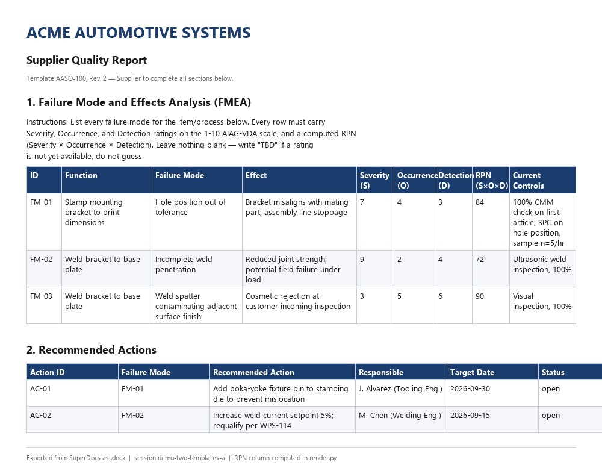
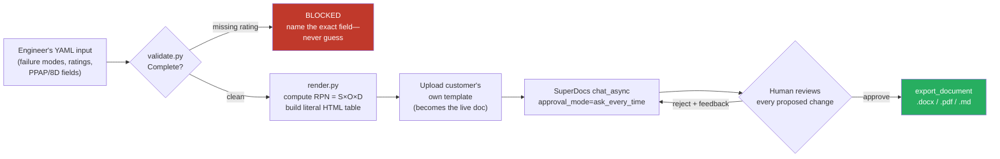
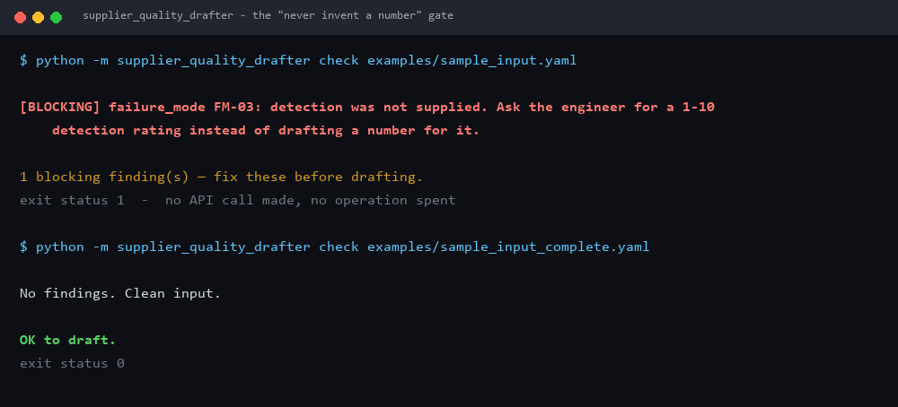
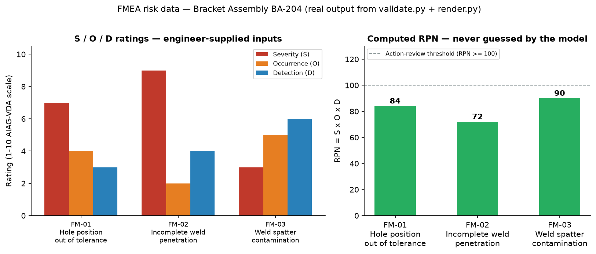
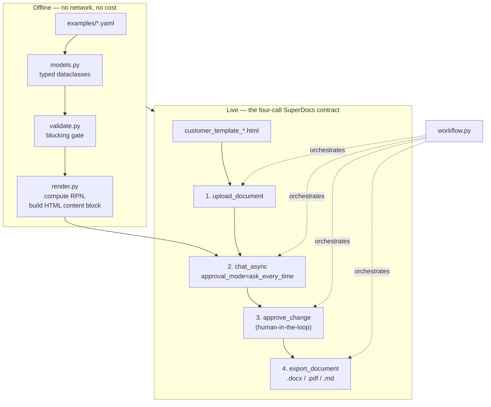

# Supplier-Quality Doc Drafter (PPAP / 8D / FMEA)

Built for the SuperDocs engineer task (Task 2, assigned build). Credit: **Uddeshya** (GitHub [@yudi1O1](https://github.com/yudi1O1)).

A drafting tool for supplier-quality engineers in automotive/manufacturing. It takes structured,
engineer-supplied data — failure modes, ratings, corrective actions, PPAP and 8D narrative fields —
and drafts the corresponding document **onto the customer's own template**, using the SuperDocs API.

Its centerpiece is the FMEA (Failure Mode and Effects Analysis) table: function, failure mode, effect,
Severity, Occurrence, Detection, and the computed Risk Priority Number (RPN = S×O×D). It also drafts
the narrative sections of a PPAP (Production Part Approval Process) submission and an 8D
(problem-solving / corrective-action) report.



*Real output, exported from SuperDocs as `.docx` in session `demo-two-templates-a`. Check the RPN column
against S×O×D on any row. The raw export is committed at
[`docs/samples/demo-template-a.md`](docs/samples/demo-template-a.md).*

## What this actually does, end to end

An engineer fills in a YAML file (failure modes, ratings, PPAP/8D narrative fields). The tool checks
that file is complete, computes every number itself, and only then talks to SuperDocs — which lays the
already-correct content into the customer's own template and hands back a finished document, gated by a
human approval step before anything is final:



Two customers can hand you two completely different Word templates for the same FMEA/PPAP/8D package —
this tool drafts the identical underlying data onto either one, changing only the presentation. See
[Live demo run](#live-demo-run) below for real numbers pulled straight out of a live API call.

## The one rule this tool is built around

> Numbers the engineer did not supply are asked for, never invented.

Every Severity/Occurrence/Detection rating and every RPN in the final document is computed in plain
Python from numbers the engineer typed in — **never by the model**. If a rating is missing, the tool
refuses to draft and tells you exactly which field is missing, in which failure mode, instead of
silently guessing a plausible-looking number. See [`validate.py`](supplier_quality_drafter/validate.py)
and [`render.py`](supplier_quality_drafter/render.py) — `render.py` renders the RPN table as a literal
HTML block with numbers already filled in, and the chat instruction explicitly tells the AI not to
recalculate or alter any number in it, only to fit it into the template's structure and formatting.

Try it yourself: `examples/sample_input.yaml` has one failure mode (`FM-03`) with a deliberately
missing `detection` rating.

```bash
python -m supplier_quality_drafter check examples/sample_input.yaml
```



Fill in the rating and it passes clean. Note the exit status: the blocked run makes **no API call and
spends no operation** — the gate is entirely offline, so being strict is free.

## What "strong" looks like here, and how this build demonstrates it

The task card names two bars:

1. **"The severity-occurrence-detection table is arithmetically consistent (priority values derive
   from their factors) and every action row traces to a named failure mode."**
   Enforced structurally, not by convention:
   - `validate.py` refuses to draft if an action's `failure_mode_id` doesn't match a real failure mode
     (`test_action_must_reference_existing_failure_mode`).
   - `render.py` computes RPN as `severity * occurrence * detection` in Python and never lets the model
     touch that arithmetic (`test_rpn_is_arithmetically_consistent_in_rendered_table`).
   - A failure mode with a high RPN (≥100) and no linked action gets flagged as a warning, so a risky
     row can't silently fall through with no corrective action.

2. **"The same inputs re-drafted onto a second customer template change presentation only."**
   `templates/customer_template_a.html` (Acme Automotive Systems' report format) and
   `templates/customer_template_b.html` (Meridian Powertrain Co.'s, a differently structured,
   differently styled template) are both synthetic, fictional-customer templates included in this repo.
   `scripts/demo_two_templates.py` drafts the *same* `examples/sample_input.yaml` onto both and asserts
   that every failure-mode ID, action ID, and numeric value (S/O/D/RPN) appears identically in both
   exports — only the surrounding structure and formatting differ. This script needs a live API key
   (it spends real operations); the same logic's *control flow* is covered without a key in
   `tests/test_workflow.py`.

## How it uses the SuperDocs API — the four-call contract

Per document, one session, four calls:

1. **Upload** — `POST /v1/documents/upload`: the customer's own template becomes the active document.
2. **Chat** — `POST /v1/chat/async` with `approval_mode: "ask_every_time"`: sends one instruction plus
   a literal, pre-computed content block (the FMEA table, PPAP narrative, or 8D narrative — see above).
3. **Approve** — `POST /v1/chat/{session_id}/approve`: every proposed change is surfaced to a human
   before it lands (see [Human-in-the-loop](#human-in-the-loop-gate) below).
4. **Export** — `POST /v1/documents/export`: the approved result, as `.docx`/`.pdf`/`.md`/etc.

See [`client.py`](supplier_quality_drafter/client.py) for the thin REST wrapper and
[`workflow.py`](supplier_quality_drafter/workflow.py) for the orchestration.

### Human-in-the-loop gate

Every draft runs in `approval_mode: "ask_every_time"` — the AI's proposed changes are never applied
sight-unseen. `python -m supplier_quality_drafter draft` (without `--auto-approve`) prints each proposed
change (old/new HTML, the AI's stated reason) and prompts before approving it. `--auto-approve` skips
the prompt for CI/demo runs — it still goes through the same approve endpoint, it just answers yes to
everything automatically. Rejecting a change doesn't discard the rest of the batch (the `changes[]`
array carries per-change decisions).

## Running cost money, so: idempotency, degradation, and a cost report

Drafting is a **billable** SuperDocs operation that takes minutes. Three behaviors follow from that.

**It doesn't buy the same operation twice.** Every draft is fingerprinted over everything that could
change its output — the session, the full instruction (which encodes every engineer-supplied number),
the template's *bytes*, and the export format. Re-running identical work reuses the previous result and
spends nothing:

```
$ python -m supplier_quality_drafter draft ... --out out/acme.docx
Drafted: out/acme.docx
Cost: 1 billable request(s) issued. Account: 45/500 operations used this month (455 remaining, tier=free).

$ python -m supplier_quality_drafter draft ...          # same inputs, again
Skipped (already drafted): out/acme.docx
Cost: 0 billable request(s) issued — an identical draft completed at 2026-08-26T20:11:04+00:00 ...
```

Two deliberate refusals to be clever, both tested: a ledger entry whose **output file was deleted is not
treated as done** (a success message that isn't true is worse than a redundant operation), and the
template is **hashed by content, not path** — editing a template in place correctly forces a redraft.
`--force` overrides; a corrupt ledger degrades open rather than blocking work.

**It degrades instead of dying.** `client.py` retries 429s, 5xx, and dropped connections with
exponential backoff plus jitter, honoring `Retry-After` when the server sends one. A rate limit or a
brief blip turns a run slower, not failed. Client errors (400/404/422) are *not* retried — retrying them
only burns time and money.

**Errors name the cause and the fix.** Every status maps to an actionable sentence rather than a bare
code:

```
POST /v1/chat/s1/approve -> [422] SuperDocs understood the request but a field failed validation.
Fix: on /approve this is almost always a missing top-level 'approved' field — it is required even
when every entry in 'changes' carries its own. Server said: {...}
```

**It reports what it cost.** The `usage` block SuperDocs returns on every chat response is surfaced
verbatim after each run — operations used, remaining, and tier. Reported, never estimated; when the
server sends no usage block, the tool says exactly that instead of guessing.

## Quickstart — one command, no API key

From a fresh clone, this installs everything and runs the full test suite:

```bash
pip install -r requirements.txt && python -m pytest -q
```

Expect `69 passed`. No SuperDocs key needed and nothing is billed — every test is offline.

To also see the validation gate refuse a draft (still no key, still free):

```bash
python -m supplier_quality_drafter check examples/sample_input.yaml
```

## Setup for live drafting

Only needed once you want to actually draft against SuperDocs:

```bash
python -m venv .venv && source .venv/bin/activate   # or .venv\Scripts\activate on Windows
pip install -r requirements.txt
export SUPERDOCS_API_KEY=sk_your_key_here            # get one at use.superdocs.app -> Settings -> API Keys
```

Pass the key by environment variable only. Don't paste it into a command line — it lands in your shell
history, which counts as a public place.

### What it accepts

**Input:** a YAML file matching the dataclasses in [`models.py`](supplier_quality_drafter/models.py),
with `document_type` of `fmea`, `ppap`, `8d`, or `combined`.
**Templates:** any format SuperDocs ingests — DOCX, DOC, ODT, PDF, TXT, HTML, MD, RTF.
**Output:** `docx` (default), `pdf`, `html`, `markdown`, `txt`.
**Domain:** automotive/manufacturing supplier quality (AIAG-VDA 1–10 severity/occurrence/detection scales).

## Usage

**1. Validate structured input without touching the network:**

```bash
python -m supplier_quality_drafter check examples/sample_input.yaml
```

**2. Draft the document onto a customer template (interactive approval):**

```bash
python -m supplier_quality_drafter draft examples/sample_input.yaml \
  --template templates/customer_template_a.html \
  --session-id acme-ba204-fmea \
  --out out/acme-ba204.docx
```

**3. Same thing, non-interactively (for a demo run):**

```bash
python -m supplier_quality_drafter draft examples/sample_input.yaml \
  --template templates/customer_template_a.html \
  --session-id acme-ba204-fmea \
  --out out/acme-ba204.docx \
  --auto-approve
```

**4. Prove content parity across two customer templates (spends 2 operations per run):**

```bash
python scripts/demo_two_templates.py --runs 3
```

**5. A second run, on genuinely different documents.** Not a variant of the demo:
[`examples/second_run_8d_only.yaml`](examples/second_run_8d_only.yaml) is a different part, a different
process (injection moulding, not stamping/welding), different failure modes, a different customer, and a
different `document_type` (`8d` alone rather than `combined`) — drafted onto the *other* template. It
exists so the drafter is demonstrably not fitted to the one example it was developed against, and it
earned its keep immediately: it exposed the verifier bug described below.

```bash
python -m supplier_quality_drafter draft examples/second_run_8d_only.yaml \
  --template templates/customer_template_b.html \
  --session-id second-run-ch77 \
  --out out/second-run-ch77.docx --auto-approve
```

Real output from that run:

```
Drafted: out/second-run-ch77.docx
Review: 1 change(s) approved, 0 rejected.
Verified: 2/2 expected fact(s) present in the exported file.
Cost: 1 billable request(s) issued. Account: 0/500 operations used this month (500 remaining, tier=free).
```

## Input format

See [`examples/sample_input.yaml`](examples/sample_input.yaml) for a fully worked, synthetic example
(fictional supplier, fictional customer — safe to commit and demo with). `document_type` is one of
`fmea`, `ppap`, `8d`, or `combined`. Failure modes, actions, PPAP fields, and 8D fields map directly
to the dataclasses in [`models.py`](supplier_quality_drafter/models.py).

## Live demo run

This is genuine output from a real SuperDocs API call (`python -m supplier_quality_drafter draft`,
`session-id demo-acme-ba204-v1`, template A, `docx` export — 38.8 KB file produced), not a mockup.
The RPN column below was computed in `render.py`, not by the model — compare against `S × O × D` and
you'll see it checks out for every row:

| ID | Severity (S) | Occurrence (O) | Detection (D) | RPN (S×O×D) |
| --- | --- | --- | --- | --- |
| FM-01 | 7 | 4 | 3 | **84** |
| FM-02 | 9 | 2 | 4 | **72** |
| FM-03 | 3 | 5 | 6 | **90** |



### Measured, not asserted: parity over repeated runs

A single green run would not support the parity claim, because the model is non-deterministic. So
`scripts/demo_two_templates.py --runs N` states its method up front, samples repeatedly, commits the raw
per-run data to [`docs/samples/parity-runs.json`](docs/samples/parity-runs.json), and reports the worst
case rather than an average.

**Method:** 29 data-derived facts (failure-mode ids, S/O/D ratings, computed RPNs, action ids, target
dates, PPAP part number and level, 8D root cause) must appear verbatim in *both* exports. Derived from
the input data model, never from the output text. Each run costs 2 billable operations; the loop halts
on the first failure unless `--keep-going` is passed, so a broken build can't quietly burn an allowance.

**First sample — parity held 1 / 3 runs.** This is the finding that mattered:

| Run | Result |
| --- | --- |
| 1 | Template B export contained **none** of the 13 facts — the content never landed |
| 2 | Template A landed the FMEA table but **silently dropped the PPAP and 8D narratives** |
| 3 | Clean |

Both failures returned `status: "completed"`. Partial application of a multi-section edit is invisible
to job status, and my earlier single-run "content parity holds" claim was simply not supported by
evidence.

**After making verification drive the retry — parity held 3 / 3 runs:**

```
run 1/3 ... parity OK  (29 facts, 1+1 attempts, 67.7s)
run 2/3 ... parity OK  (29 facts, 1+1 attempts, 59.8s)
run 3/3 ... parity OK  (29 facts, 1+1 attempts, 83.9s)

parity held: 3/3
latency: median 67.7s, worst 83.9s, stdev 12.3s
drafts needing a retry (cold-session no-op): 0/6
```

**What that does and does not prove.** Note the last line: **zero retries fired** in the second sample,
so those runs happened to be clean and the retry never had to prove itself there. What is established
is (a) the failure mode is real and was directly observed, and (b) the tool now *detects* it and
redrafts rather than shipping a wrong document. What is **not** established is a failure rate — n=3 is a
smoke sample, not a statistic, and the two samples differing this much is itself evidence the rate is
unstable. Treat 1/3 and 3/3 as "this is flaky and now guarded", not as a before/after measurement.

### Two bugs the live runs caught — the second one mattered

**1. A Windows console crash (mine).** The CLI died with `UnicodeEncodeError` when the AI's response
contained an emoji the default `cp1252` codepage couldn't encode. The `.docx` had already exported fine;
only the summary print failed. Fixed by reconfiguring stdout/stderr to UTF-8 at startup (`cli.py`).
General note for anyone building a SuperDocs CLI on Windows: the `response` text is emoji-capable and
your output stream needs to be too.

**2. A success message that wasn't true (mine, and much worse).** On a cold session, SuperDocs returned
a **`completed`** job whose response read:

```
⚠️ 0 of 4 asked could be completed.
• Failed: an edit — no matching sections were found to act on
Notes: ... none of the requested operations could be applied, and the document was not modified.
```

The document was untouched — and this tool printed `Drafted: out/verify-final.docx` and recorded the run
in its idempotency ledger as finished work. So the *next* run would have "skipped" and handed back a
document that had never been drafted. Two failures compounding: a false success, then that false success
being cached.

The root cause was treating `status == "completed"` as "it worked". It isn't. The fix, in
[`verify.py`](supplier_quality_drafter/verify.py) and the workflow:

- **`document_was_modified()`** — a turn that returns no `updated_html`, or returns HTML identical to
  what was uploaded, is a no-op regardless of status. It now raises `DraftNotApplied` instead of
  reporting success, quotes what SuperDocs actually said, exports nothing, and records nothing.
- **A retry on the no-op**, because this is documented SuperDocs behavior rather than a mystery: *"the
  first request in a fresh session can be slow or can fail while things warm up. Send it again and it
  settles."* It did settle on the second attempt.
- **`verify_export()`** — after export, the file on disk is read back (a `.docx` is a zip, so its body
  XML is checked without adding a `python-docx` dependency) and every expected fact — failure-mode ids,
  computed RPNs, action ids, dates, part number — must be present. Missing facts raise `DraftUnverified`.
  Unreadable formats like PDF are reported as *"verification skipped, not passed"*, never counted as a pass.

Both live behaviors are now locked down by
[`tests/test_never_bluffs.py`](tests/test_never_bluffs.py), which replays that exact payload offline. The
run after the fix:

```
Drafted: out/verify-final.docx
Review: 4 change(s) approved, 0 rejected.
Verified: 11/11 expected fact(s) present in the exported file.
Cost: 1 billable request(s) issued. Account: 0/500 operations used this month (500 remaining, tier=free).
```

**3. A verifier that refused valid work (mine).** The first run with `document_type: 8d` rejected a
*correct* 8D document, because `expected_facts` demanded FMEA rows back — it had been written against
the one `combined` example it was developed on. A verifier that wrongly refuses valid work is worse than
no verifier. `expected_facts` now mirrors exactly what `render.py` emits per document type, and a
parametrized test asserts the invariant across all four types: whatever the renderer produces must
satisfy the verifier.

### Two things worth reporting upstream

Neither is a crash; both are integration hazards that silently produce wrong output:

1. **A job can reach `status: "completed"` with every operation failed** ("0 of 4 asked could be
   completed", document untouched). The response body says so clearly, but an integrator switching on
   status will ship false successes — as this build did until a live run caught it.
2. **A multi-section edit can apply partially and still report completed.** Observed directly: a
   four-section draft landed the FMEA table and dropped the PPAP and 8D narratives, with no error and no
   signal in the status. This is the harder one, because the output *looks* plausible — it is a real
   document, just missing sections. Anything short of reading the exported file back will miss it.

Both are why this build verifies the exported bytes rather than trusting a status string.

## Tests (no live key required)

```bash
pip install -r requirements.txt   # includes pytest
python -m pytest tests/ -q
```

69 tests, all offline:

- `test_validate.py` — the "never invent a number" gate: missing ratings are blocking findings, not
  silently defaulted; out-of-range ratings are rejected; actions must trace to a real failure mode;
  duplicate failure-mode IDs are caught; a high-RPN row with no linked action produces a warning.
- `test_render.py` — RPN arithmetic in the rendered table matches `S × O × D` exactly; a missing
  rating renders as `TBD`, never as a plausible-looking number; free-text fields are HTML-escaped
  (a failure-mode description containing `<script>` cannot inject markup into the instruction sent to
  the API — see *Content safety* below).
- `test_workflow.py` — the four-call contract, the human-in-the-loop approval loop (including multiple
  rounds of `awaiting_approval`, a `continue_prompt` pause routed to `/continue` rather than `/approve`,
  and a custom callback that rejects a change), that `draft_document` refuses to make **any** network
  call when validation fails, and the idempotency gate (identical rerun spends zero billable calls;
  `--force` and an edited template both correctly defeat the skip).
- `test_client.py` — graceful degradation and actionable errors: 429/5xx/dropped-connection all retried
  with backoff, `Retry-After` honored over our own curve, 4xx deliberately *not* retried, every mapped
  status naming a concrete fix, and usage read from the server rather than estimated.
- `test_ledger.py` — fingerprint stability and sensitivity (instruction, template bytes, export format),
  a deleted output file never reported as "already done", and a corrupt ledger degrading open.
- `test_never_bluffs.py` — replays the **exact** payloads from the live runs described above: a
  `completed` job that changed nothing must raise rather than report success, must not export, and must
  not be cached in the ledger; a partial application is redrafted from the clean template; a cold session
  that settles on retry succeeds; an export missing the engineer's facts is rejected; an unverifiable
  format is reported as unverified rather than passed; and — parametrized over all four document types —
  whatever `render.py` emits must satisfy `verify.py`, so the verifier can never again refuse valid work.

Every network-touching call is behind a duck-typed interface, so the orchestration tests run against a
`FakeClient` and the client tests run against a fake transport — **no mocking library, no live key, no
cost, and no test that merely proves a mock works.** `test_client.py` drives the real retry/backoff/error
code; only the socket is fake.

## Content safety: this tool doesn't take orders from the documents it edits

Free-text fields (failure-mode descriptions, effects, narrative sections) come from the engineer's own
YAML input, not from an untrusted document — but they're still escaped before being embedded in the
HTML content block (`test_html_is_escaped_to_avoid_injection_from_free_text_fields`), so a stray `<` or
`&` in someone's free-text description can't be misread as markup or, in a future version that pulls
fields from an uploaded source document, as an embedded instruction.

## Known limitations (logged honestly)

- **Template matching is structural, not by ID.** The SuperDocs API doesn't expose a `template_id`
  parameter on `/v1/chat`; it searches your uploaded template library by relevance. To get deterministic
  "use exactly this customer's template" behavior, this tool uploads the customer's template as the
  *active document* (`/v1/documents/upload`) and asks the AI to populate it in place, rather than
  relying on template search. This is why `templates/upload` isn't in the four-call path here — the
  template *is* the starting document for the session.
- **PDF/DOCX customer templates work too**, but the two included demo templates are `.html` for
  readability in a PR diff. `SuperDocsClient.upload_document` takes any of DOCX/DOC/ODT/PDF/TXT/HTML/MD/RTF.
- **Resumability is coarse-grained.** The ledger makes a re-run after a crash *cheap and safe* — an
  already-completed draft is reused rather than re-billed. But a process killed **mid-job**, after
  `chat_async` returned a `job_id` and before the export, does not reconnect to that in-flight job on
  restart; it starts the draft again. The honest fix is persisting `job_id` at creation and re-polling
  it on startup, which is a ~20-line change I chose not to make because this build's card scopes it to
  `chat, templates, export`, and fine-grained crash-resumability is Task 1's requirement, not this one.
  Naming it rather than implying the ledger covers it.
- **The retry budget is fixed, not adaptive.** Three retries with exponential backoff; a sustained
  outage still fails the run (correctly — it just fails slower and with a message that says why).
- **`--auto-approve` is for CI/demo runs only.** It still goes through the real approve endpoint (it's
  not a bypass), but production use of this tool should default to interactive review, per the task's
  human-in-the-loop framing.

## Architecture



`client.py` is the thin REST wrapper around those four calls; `cli.py` is the only place that talks to
a human (interactive approval prompts, `check`/`draft` subcommands).
